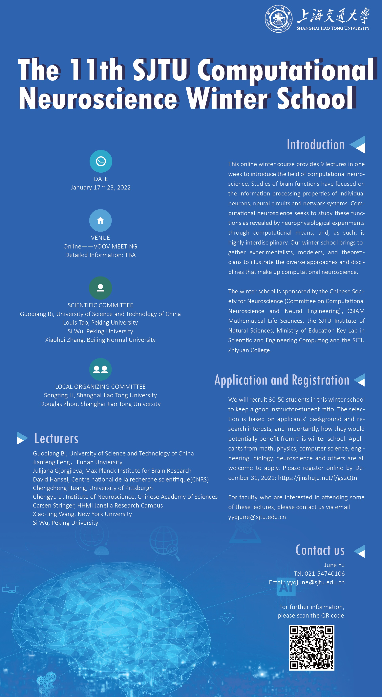

# The 11th Computational Neuroscience Winter School

**Jan. 17-23, 2022**

*Organized by **Lab of computational neuroscience**, Shanghai Jiao Tong University*

---

## Introduction

This online winter course provides 9 lectures in one week to introduce the field of computational neuroscience. Studies of brain functions have focused on the information processing properties of individual neurons, neural circuits and network systems. Computational neuroscience seeks to study these functions as revealed by neurophysiological experiments through computational means, and, as such, is highly interdisciplinary. Our winter school brings together experimentalists, modelers, and theoreticians to illustrate the diverse approaches and disciplines that make up computational neuroscience.

The winter school is sponsored by the Chinese Neuroscience Society (Committee on Computational Neuroscience and Neural Engineering)，CSIAM Mathematical Life Sciences, the SJTU Institute of Natural Sciences, Ministry of Education-Key Lab in Scientific and Engineering Computing and the SJTU Zhiyuan College.

## Schedule

|Date|Jan 17|Jan 18|Jan 19|Jan 20|Jan 21|Jan 22|
|-|-|-|-|-|-|-|
|**Morning (9:00-11:00)**|Si Wu||Carsen Stringer|Chengcheng Huang|Xiao-Jing Wang|Guoqiang Bi|
|Language|*Chinese*||*English*|*Chinese*|*English*|*Chinese*|
|**Afternoon (14:00-16:00)**||Chengyu Li|Tutorial 1: Dimension Reduction|David Hansel (15:00-17:00)|Tutorial 2: Neuronal Dynamics||
|Language||*Chinese*|*Chinese*|*English*|*Chinese*||
|**Evening (20:00-22:00)**||Jianfeng Feng|Julijana Gjorgjieva||||
|Language||*Chinese*|*English*||||
## Tutorial Schedule

|Topics|Date| Time |
|--|--|--|
|Tutorial 1: Dimension Reduction| Jan. 19, 2021 | 14:00-16:00 |
|Tutorial 2: Neuronal Dynamics| Jan. 21, 2021 | 14:00-16:00 |

## Venue

Online——VooV

## Detailed Information
[Link](https://ins.sjtu.edu.cn/conferences/2011)

---
## Programs

### Continuous attractor neural networks
*by Si Wu, Peking University*

### Synaptic plasticity and function in developing neural circuits
*by Julijana Gjorgjieva, Max Planck Institute for Brain Research*

### Dynamic neural mechanism underlying working memory
*by Chengyu Li, Institute of Neuroscience, Chinese Academy of Sciences*

### Brain-inspired AI
*by Jianfeng Feng, Fudan Unviersity*

### TBA
*by Carsen Stringer, HHMI Janelia Research Campus*
### [Tutorial 1: Dimension Reduction](./tutorial1/)

*by Kai Chen, Shanghai Jiao Tong University*

### Neural variability in circuit models of cortex
*by Chengcheng Huang,niversity of Pittsburgh*

### Theory of features selectivity in rodent primary visual cortex
*by David Hansel, Centre national de la recherche scientifique(CNRS)*

### Distributed dynamics and cognition in large-scale brain circuits
*by Xiao-Jing Wang, New York University*

### [Tutorial 2: Neuronal Dynamics](./tutorial2/)

*by Ziling Wang, Shanghai Jiao Tong University*

### The multi-scale complexity of the nervous system – from synaptic molecules to brain-wide circuits
*by Guoqiang Bi, University of Science and Technology of China*

---
## Poster

