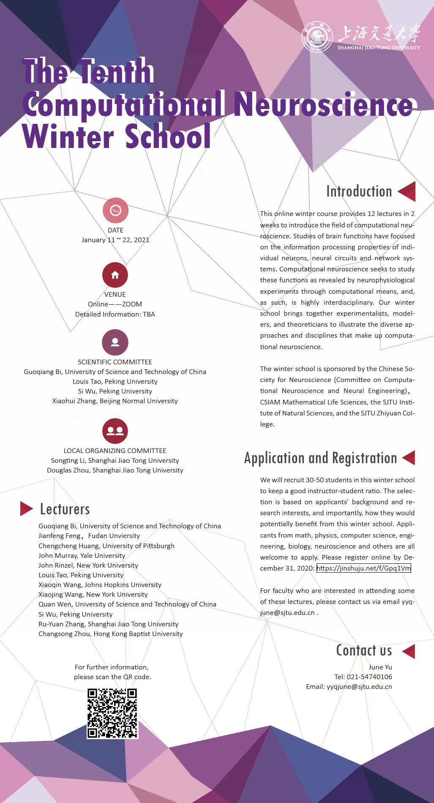

# The Tenth Computational Neuroscience Winter School
---
## Introduction

This online winter course provides 12 lectures and 2 tutorials in 2 weeks to introduce the field of computational neuroscience. Studies of brain functions have focused on the information processing properties of individual neurons, neural circuits and network systems. Computational neuroscience seeks to study these functions as revealed by neurophysiological experiments through computational means, and, as such, is highly interdisciplinary. Our winter school brings together experimentalists, modelers, and theoreticians to illustrate the diverse approaches and disciplines that make up computational neuroscience.

The winter school is sponsored by the Chinese Society for Neuroscience (Committee on Computational Neuroscience and Neural Engineering)，CSIAM Mathematical Life Sciences, the SJTU Institute of Natural Sciences, Ministry of Education-Key Lab in Scientific and Engineering Computing and the SJTU Zhiyuan College.

## Tutorial ScheduleDate

|Topics|Date| Time |
|--|--|--|
|Tutorial 1: Neuronal Dynamics| Jan. 13, 2021 | 15:00-17:00 |
|Tutorial 2: Data Analysis| Jan. 16, 2021 | 09:00-11:00 |

## Venue

Online——ZOOM

Detailed Information: TBA

## Detailed Information
[Link](https://ins.sjtu.edu.cn/schools/2021/01/12/the-tenth-computational-neuroscience-winter-school/1851)

## Poster

